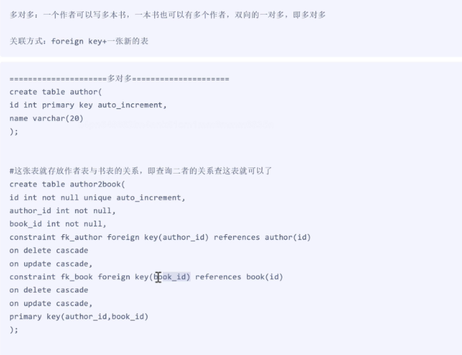
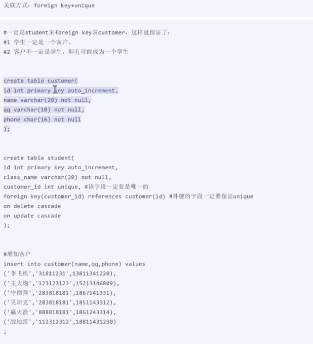

# 数据库登录

```sql
mysql -u root -p  // root 是数据库用户名
// 或者
mysql -uroot -p1234  // 1234 是数据库密码 root 是数据库用户名
//修改密码
      
mysqladmin -uroot -p1234 password '123456' // 123456 是新密码
```

## 操作文件夹（库）
```sql
 // 增加库
create database db_name charset utf8;
 // 查看库
show create database db_name;
 // 查看所有的数据库
show databases;
 // 改库
alter database db_name charset gbk;
 // 删除库
drop database db_name;
 // 切换库
use db_name;
 // 查看当前库
select database();
```
## 操作文件（表）
```sql
-- 增加表
create table table_name(id int, name char);
-- 查看表
show create table table_name;
-- 查看所有的表
show tables;
-- 查看表结构
desc table_name;
-- 改表
alter table table_name add column age int;
alter table table_name modify name char(6);
alter table table_name change name NAME char(7);
-- 删除表
drop table table_name;
```
### 改表具体语法
```sql
--添加列
ALTER TABLE table_name ADD COLUMN column_name column_definition;
ALTER TABLE users ADD COLUMN age INT; //添加 age 列
-- 删除列
ALTER TABLE table_name DROP COLUMN column_name;
ALTER TABLE users DROP COLUMN age; //删除 age 列
--修改列数据类型或属性
ALTER TABLE table_name MODIFY COLUMN column_name new_definition;
ALTER TABLE users MODIFY COLUMN age TINYINT; //修改 age 列的数据类型为 TINYINT
-- 重命名列
ALTER TABLE table_name CHANGE COLUMN old_name new_name column_definition;   
ALTER TABLE users CHANGE COLUMN age user_age INT;  //将 age 列重命名为 user_age
-- 重命名表
ALTER TABLE old_table_name RENAME TO new_table_name;
ALTER TABLE users RENAME TO customers; //将 users 表重命名为 customers
--添加索引
ALTER TABLE table_name ADD INDEX index_name (column_name);
ALTER TABLE users ADD INDEX idx_name (name); //为 name 列添加索引
-- 删除索引
ALTER TABLE table_name DROP INDEX index_name;
ALTER TABLE users DROP INDEX idx_name; // 删除名为 idx_name 的索引
--修改表的存储引擎
ALTER TABLE table_name ENGINE = new_engine;
ALTER TABLE users ENGINE = InnoDB; // 将 users 表的存储引擎改为 InnoDB
--添加外键约束
ALTER TABLE table_name ADD CONSTRAINT fk_name FOREIGN KEY (column_name) REFERENCES other_table(column_name);
ALTER TABLE orders ADD CONSTRAINT fk_user_id FOREIGN KEY (user_id) REFERENCES users(id); // 为 orders 表的 user_id 添加外键约束，引用 users 表的 id
--删除外键约束
ALTER TABLE table_name DROP FOREIGN KEY fk_name;
ALTER TABLE orders DROP FOREIGN KEY fk_user_id; // 删除 orders 表中的外键约束 fk_user_id
--设置默认值
ALTER TABLE table_name ALTER COLUMN column_name SET DEFAULT default_value;
ALTER TABLE users ALTER COLUMN age SET DEFAULT 18; //为 age 列设置默认值 18
--删除默认值
ALTER TABLE table_name ALTER COLUMN column_name DROP DEFAULT;
ALTER TABLE users ALTER COLUMN age DROP DEFAULT; //删除 age 列的默认值
```
### 复制表
```sql
--复制表结构和数据
CREATE TABLE new_table_name AS SELECT * FROM original_table_name;
CREATE TABLE new_table_name AS SELECT * FROM original_table_name; // 将 original_table_name 的表结构和数据复制到 new_table_name
--只复制表结构（不复制数据）
CREATE TABLE new_table_name LIKE original_table_name;
CREATE TABLE new_table_name LIKE original_table_name; // 将 original_table_name 的表结构复制到 new_table_name，但不复制数据
--复制部分数据
CREATE TABLE new_table_name AS SELECT column1, column2, ... FROM original_table_name WHERE condition;
CREATE TABLE new_table_name AS SELECT id, name FROM original_table_name WHERE id > 10; // 将满足条件的数据复制到 new_table_name
```
## 操作文件内容（记录）
```sql
-- 增加记录
insert table_name(id,name) values (1,'eg1'),(2,'eg2'),(3,'eg3');
-- 查看记录
select id, name from table_name; // 在当前库
select id, name from db_name.table_name // 在其他库
select * from table_name; // 查看所有字段
-- 修改记录
update db_name.table_name set name="SB";
update db_name.table_name set name="SB" where id=3;
-- 删除记录
delete from table_name; // 删除整张表数据
delete from table_name where id=3; // 删除id为3的那条数据
```

# 存储引擎 -- 表的类型
```sql
-- 查看所有支持的存储引擎
show engines;
-- 查看正在使用的存储引擎
SHOW VARIABLES LIKE 'default_storage_engine';
-- 创建表时指定存储引擎
CREATE TABLE table_name (
    id INT PRIMARY KEY,
    name VARCHAR(100)
) ENGINE=InnoDB;
-- 修改现有表的存储引擎
ALTER TABLE table_name ENGINE=InnoDB;
```

## 整数类型
```sql
整数类型 TINYINT SMALLINT MEDIUMINT INT BIGINT
作用 存储年龄 等级 id 各种号码等
浮点类型 FLAOAT DOUBLE DECIMAL
作用 存储薪资 身高 体重 体制参数等
```

## 时间类型
```sql
year data    time      datatime
年  年-月-日  时-分-秒   年-月-日 时-分-秒
```

## 字符类型
```sql
char : 定长
varchar: 变长
```

## 约束条件
```sql
not null | default | primary key | unique key | foreign key | auto_increment
 不为空   | 默认值   | 主键         |  唯一约束    | 外键约束     | 自增
 
# 需要创建被关联的表,并且保证被关联的字段唯一
crate table emp(
  id int primary key,
  name varchar(20),
  sex enum('男','女'),
  dep_id int,
  froreign key(dep_id) references dept(id) # 外键约束 emp表的dep_id字段和dept表的id字段关联
  on delete cascade on update cascade # 删除同步 更新同步
)
```
## 清空表
```sql
  delete from table_name; // 清空表数据,但是自增长值不会重置
  truncate table_name; // 清空表数据,同时自增长值也会重置
```

## 表的关系
#### 多对多


#### 一对一

```sql
-- 多对一 一张表的多条记录对应另一张表的一条记录
-- 多对多 一张表的多条记录对应另一张表的多条记录 就是双向的多对一
-- 一对一 一张表的一条记录对应另一张表的一条记录 
```

### 数据操作
#### 插入数据
```sql
1. 插入完整数据（顺序插入）
    语法一：
    INSERT INTO 表名(字段1,字段2,字段3…字段n) VALUES(值1,值2,值3…值n);

    语法二：
    INSERT INTO 表名 VALUES (值1,值2,值3…值n);

2. 指定字段插入数据
    语法：
    INSERT INTO 表名(字段1,字段2,字段3…) VALUES (值1,值2,值3…);

3. 插入多条记录
    语法：
    INSERT INTO 表名 VALUES
        (值1,值2,值3…值n),
        (值1,值2,值3…值n),
        (值1,值2,值3…值n);
        
4. 插入查询结果
    语法：
    INSERT INTO 表名(字段1,字段2,字段3…字段n) 
                    SELECT (字段1,字段2,字段3…字段n) FROM 表2
                    WHERE …;
```
#### 更新数据UPDATE
````sql
语法：
    UPDATE 表名 SET
        字段1=值1,
        字段2=值2,
        WHERE CONDITION;

示例：
    UPDATE mysql.user SET password=password(‘123’) 
        where user=’root’ and host=’localhost’;
````
#### 删除数据DELETE
```sql
语法：
    DELETE FROM 表名 
        WHERE CONITION;

示例：
    DELETE FROM mysql.user 
        WHERE password=’’;

练习：
    更新MySQL root用户密码为mysql123
    删除除从本地登录的root用户以外的所有用户
```
#### 单表查询 
https://www.cnblogs.com/linhaifeng/articles/7267592.html
```sql
-- DISTINCT 去重
SELECT DISTINCT 字段列表 FROM 表名   
     WHERE 条件
     GROUP BY 分组
     HAVING 过滤
     ORDER BY 排序
     LIMIT 值;
```
### where 约束条件
```sql
 select * from table where id > 9
 select * from table where post="teacher" and salary > 8000
 select * from table where salary between 5000 and 8000 // between 包含左右边界
 select * from table where salary < 5000 or salary > 8000
 select * from table where salary not between 5000 and 8000
 select * from table where age = 28 or age = 29
 select * from table where age in (28,29)
 select * from table where age is null 
  -- 通配符’%’
    SELECT * FROM employee 
            WHERE name LIKE 'eg%';

   -- 通配符’_’
    SELECT * FROM employee 
            WHERE name LIKE 'al__';
```

### group by 分组
```sql
set global sql_mode='ONLY_FULL_GROUP_BY'; --# 由于没有设置ONLY_FULL_GROUP_BY,于是也可以有结果，默认都是组内的第一条记录，但其实这是没有意义的
select post,count(id) from emp group by post; --#只能查看分组依据和使用聚合函数

--单独使用GROUP BY关键字分组
    SELECT post FROM employee GROUP BY post;
    --注意：我们按照post字段分组，那么select查询的字段只能是post，想要获取组内的其他相关信息，需要借助函数

--GROUP BY关键字和GROUP_CONCAT()函数一起使用
    SELECT post,GROUP_CONCAT(name) FROM employee GROUP BY post;--岗位分组，并查看组内成员名
    SELECT post,GROUP_CONCAT(name) as emp_members FROM employee GROUP BY post;

--GROUP BY与聚合函数一起使用
    select post,count(id) as count from employee group by post;--按照岗位分组，并查看每个组有多少人
```

### 聚合函数
```sql
count() 统计个数
sum() 求和
avg() 平均值
max() 最大值
min() 最小值
group_concat() 拼接
having() 过滤分组 
```

### having 过滤分组 
```sql
--！！！执行优先级从高到低：where > group by > having 
-- 1. Where 发生在分组group by之前，因而Where中可以有任意字段，但是绝对不能使用聚合函数。
--2. Having发生在分组group by之后，因而Having中可以使用分组的字段，无法直接取到其他字段,可以使用聚合函数
select post ,group_concat(name), count(id) from table group by post having count(id) < 2;
```

### order by 排序
```sql
--按单列排序
    SELECT * FROM employee ORDER BY salary;
    SELECT * FROM employee ORDER BY salary ASC; -- 升序
    SELECT * FROM employee ORDER BY salary DESC; -- 降序

--按多列排序:先按照age排序，如果年纪相同，则按照薪资排序
    SELECT * from employee
        ORDER BY age,
        salary DESC;
```

### limit 限制
```sql
SELECT * FROM employee LIMIT 3;
 SELECT * FROM employee ORDER BY salary DESC 
        LIMIT 3;                    --#默认初始位置为0 
    
    SELECT * FROM employee ORDER BY salary DESC
        LIMIT 0,5; --#从第0开始，即先查询出第一条，然后包含这一条在内往后查5条

    SELECT * FROM employee ORDER BY salary DESC
        LIMIT 5,5; --#从第5开始，即先查询出第6条，然后包含这一条在内往后查5条
```

### 多表查询 连表操作
https://www.cnblogs.com/linhaifeng/articles/7267596.html
```sql

SELECT 字段列表
    FROM 表1 INNER|LEFT|RIGHT JOIN 表2
    ON 表1.字段 = 表2.字段
```
#### 内连接：只连接匹配的行
```sql
select employee.id,employee.name,employee.age,employee.sex,department.name from employee inner join department on employee.dep_id=department.id; 
```
#### 外链接之左连接：优先显示左表全部记录
```sql
select employee.id,employee.name,department.name as depart_name from employee left join department on employee.dep_id=department.id;
```
#### 外链接之右连接：优先显示右表全部记录
```sql
select employee.id,employee.name,department.name as depart_name from employee right join department on employee.dep_id=department.id;
```
#### 全外连接：显示左右两个表全部记录
```sql
--全外连接：在内连接的基础上增加左边有右边没有的和右边有左边没有的结果
--#注意：mysql不支持全外连接 full JOIN
--#强调：mysql可以使用此种方式间接实现全外连接
select * from employee left join department on employee.dep_id = department.id
union
select * from employee right join department on employee.dep_id = department.id
```

### 子查询
```sql
--#1：子查询是将一个查询语句嵌套在另一个查询语句中。
--#2：内层查询语句的查询结果，可以为外层查询语句提供查询条件。
--#3：子查询中可以包含：IN、NOT IN、ANY、ALL、EXISTS 和 NOT EXISTS等关键字
--#4：还可以包含比较运算符：= 、 !=、> 、<等
```
#### 带IN关键字的子查询
```sql
--#查询平均年龄在25岁以上的部门名
select id,name from department
    where id in 
        (select dep_id from employee group by dep_id having avg(age) > 25);

--#查看技术部员工姓名
select name from employee
    where dep_id in 
        (select id from department where name='技术');

--#查看不足1人的部门名(子查询得到的是有人的部门id)
select name from department where id not in (select distinct dep_id from employee);
```

#### 带ANY关键字的子查询
```sql
--#在 SQL 中 ANY 和 SOME 是同义词，SOME 的用法和功能和 ANY 一模一样。

--# ANY 和 IN 运算符不同之处1
--ANY 必须和其他的比较运算符共同使用，而且ANY必须将比较运算符放在 ANY 关键字之前，所比较的值需要匹配子查询中的任意一个值，这也就是 ANY 在英文中所表示的意义

--例如：使用 IN 和使用 ANY运算符得到的结果是一致的
select * from employee where salary = any (
select max(salary) from employee group by depart_id);

select * from employee where salary in (
select max(salary) from employee group by depart_id);

--结论：也就是说“=ANY”等价于 IN 运算符，而“<>ANY”则等价于 NOT IN 运算符

--# ANY和 IN 运算符不同之处2
--ANY 运算符不能与固定的集合相匹配，比如下面的 SQL 语句是错误的

SELECT
*
FROM
T_Book
WHERE
FYearPublished < ANY (2001, 2003, 2005) 
```

####  带ALL关键字的子查询
```sql
--# all同any类似，只不过all表示的是所有，any表示任一
--查询出那些薪资比所有部门的平均薪资都高的员工=》薪资在所有部门平均线以上的狗币资本家
select * from employee where salary > all (
select avg(salary) from employee group by depart_id);

--查询出那些薪资比所有部门的平均薪资都低的员工=》薪资在所有部门平均线以下的无产阶级劳苦大众
select * from employee where salary < all (
select avg(salary) from employee group by depart_id);

--查询出那些薪资比任意一个部门的平均薪资低的员工=》薪资在任一部门平均线以下的员工
select * from employee where salary < any ( select avg(salary) from employee group by depart_id); 

--查询出那些薪资比任意一个部门的平均薪资高的员工=》薪资在任一部门平均线以上的员工
select * from employee where salary > any (
select avg(salary) from employee group by depart_id); 
```

#### 带比较运算符的子查询
```sql
--#比较运算符：=、!=、>、>=、<、<=、<>
--#查询大于所有人平均年龄的员工名与年龄
select name,age from emp where age > (select avg(age) from emp);
--#查询大于部门内平均年龄的员工名、年龄
select t1.name,t1.age from emp t1
inner join 
(select dep_id,avg(age) avg_age from emp group by dep_id) t2
on t1.dep_id = t2.dep_id
where t1.age > t2.avg_age; 
```

#### 带EXISTS关键字的子查询
```sql
--EXISTS关字键字表示存在。在使用EXISTS关键字时，内层查询语句不返回查询的记录。
--而是返回一个真假值。True或False
--当返回True时，外层查询语句将进行查询；当返回值为False时，外层查询语句不进行查询
--查询大于所有人平均年龄的员工名与年龄
select * from employee
   where exists
   (select id from department where id=200);
```

### 权限管理
https://www.cnblogs.com/linhaifeng/articles/7267587.html#_label6
```sql
-- 创建账号
    create user
    -- 本地账号
           create user 'root'@'localhost' identified by '123456';
    -- 远程账号
          create user 'root'@'193.168.21.10' identified by '123456'; --服务端ip
          create user 'root'@'193.168.21.%' identified by '123456'; --服务端ip 
          create user 'root'@'%' identified by '123456';
-- 授权
--user #该表放行的权限，针对：所有数据，所有库下所有表，以及表下的所有字段
--db #该表放行的权限，针对：某一数据库，该数据库下的所有表，以及表下的所有字段
--tables_priv #该表放行的权限。针对：某一张表，以及该表下的所有字段
--columns_priv #该表放行的权限，针对：某一个字段

--#按图解释：
--user：放行db1，db2及其包含的所有
--db：放行db1，及其db1包含的所有
--tables_priv:放行db1.table1，及其该表包含的所有
--columns_prive:放行db1.table1.column1，只放行该字段          
```