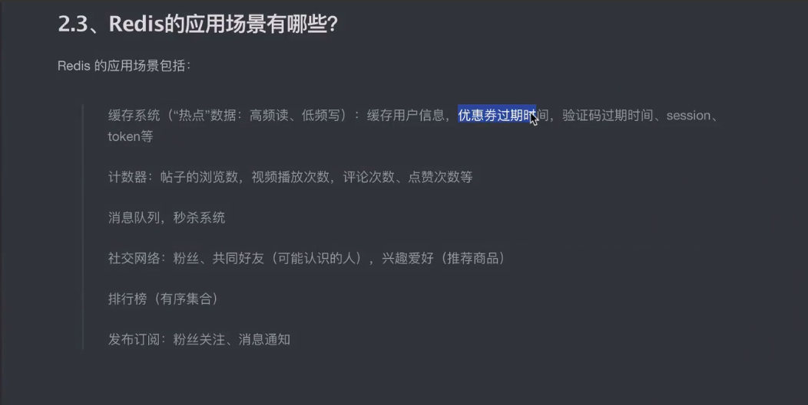
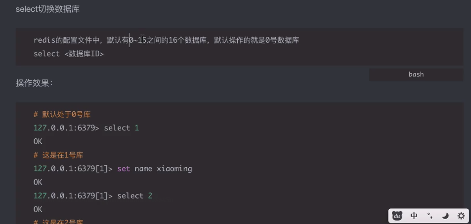
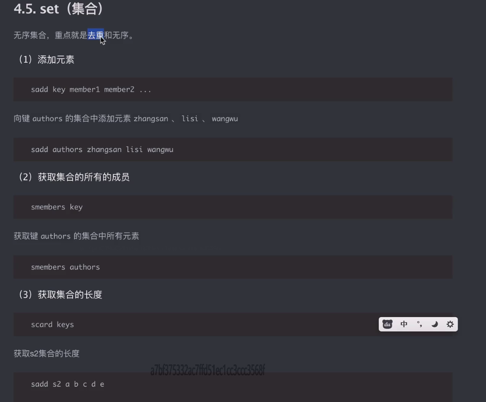
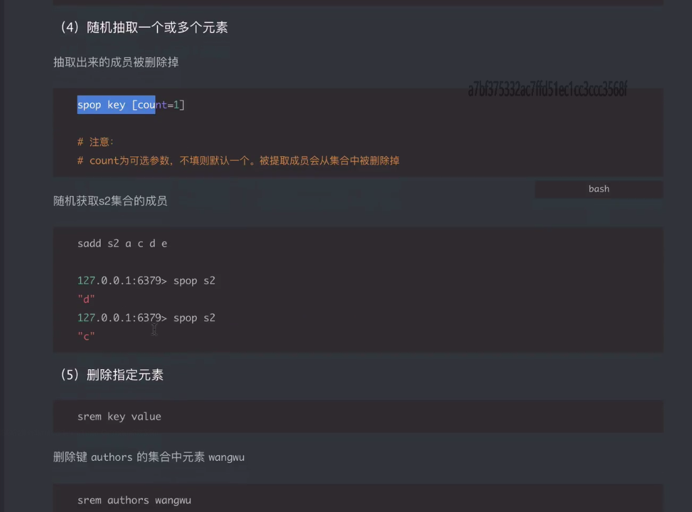
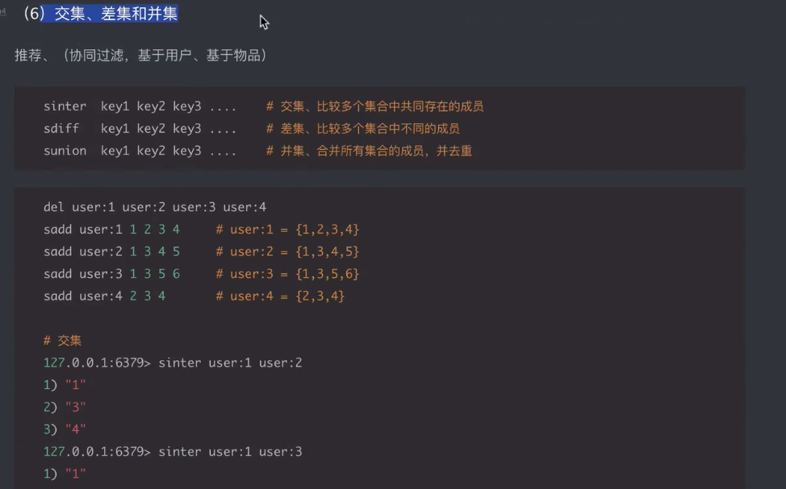
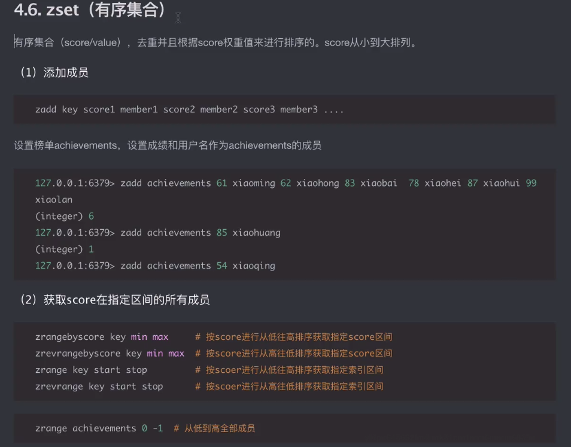
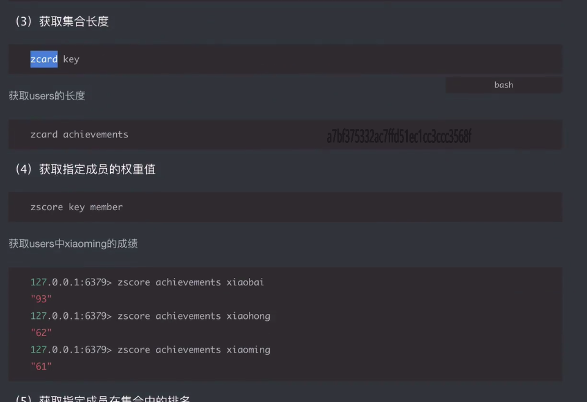
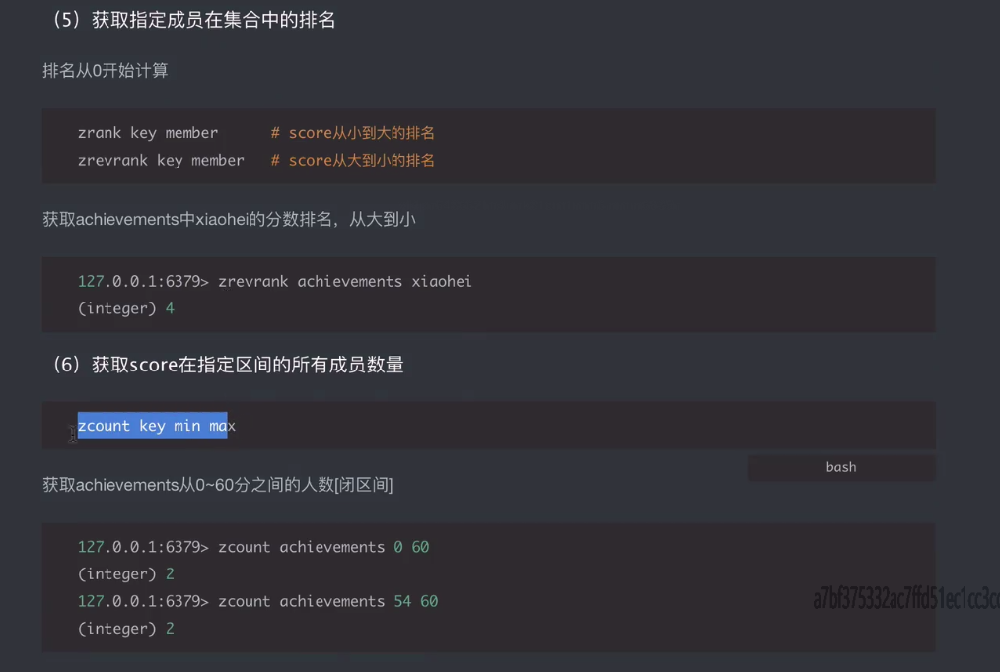
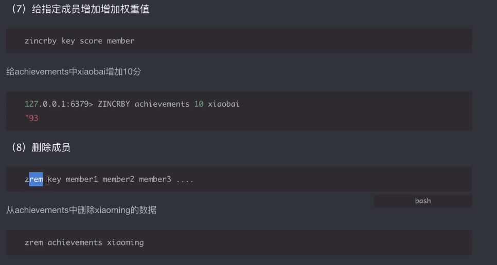
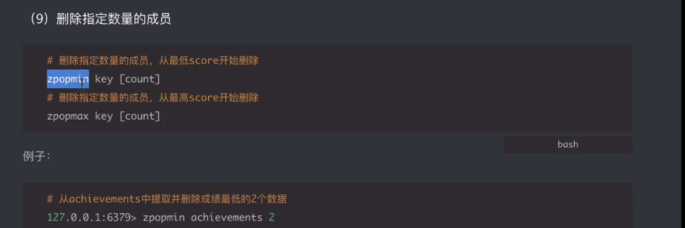

# 下载redis
###### https://github.com/tporadowski/redis/releases
###### https://www.redis.net.cn/tutorial/3509.html
>单个数据的容量不能超过512M
#### 启动redis
redis-server
#### 查看端口占用
netstat -ano | findstr 6379

#### 杀死进程
taskkill /PID 20712 /F

#### redis 字符串操作

```redis
set name "hello" # 设置字符串
get name # 获取字符串

setnx name "hello" # 设置字符串，如果key存在，则不设置, 返回0,其实就是不能重新赋值

del key # 删除字符串

setex key time value # 设置字符串，并设置过期时间

mset key1 value1 key2 value2 # 批量设置字符串
mget key1 key2 # 批量获取字符串

append key value # 追加字符串

incr key # 自增
incrby key value # 自增指定值
decr key # 自减
decrby key value # 自减指定值

strlen key # 获取字符串长度 
```

#### redis key的操作
```redis
keys * # 获取所有key
keys *a # 获取所有以a结尾的key
keys a* # 获取所有以a开头的key
keys *a* # 获取所有包含a的key

exists key # 判断key是否存在
type key # 获取key的对应值类型
del key1 key2 .... # 删除key

ttl key # 获取key的剩余时间

expire key time # 设置key的过期时间

rename oldkey newkey # 修改key名

flushall # 清空所有的key
```


#### redis 对列表的操作(数组) 队列、列表的子成员必须是string
```redis
# 添加子成员
lpush key val1 val2 # 在左侧（前）添加一条或者多条数据
rpush key val1 val2 # 在右侧（后）添加一条或者多条数据

# 在指定元素的左边（前）/ 右边（后） 插入一个数据
linsert key before 指定元素 value  
linsert key after 指定元素 value

lindex key index # 根据指定索引（下标）获取成员的值，负数下标从右边-1开始，逐个递减
# 移出并获取列表的第一个成员或最后一个成员
lpop key # 第一个成员出列
rpop key # 最后一个成员出列

lrange key start stop # 获取指定key的区间值，闭区间

llen key # 获取列表长度

lset key index value # 按照索引设置值

LREM key count value 移除列表元素
```

#### redis 对哈希的操作
键key: {
  域field： 值value,
  域field： 值value,
  域field： 值value
  
}
```redis
hset key field value  # 设置指定键的属性/域
hget key field  # 获取指定键域的值
hgetall key # 获取key下所有
hmget key field1 field2... # 获取指定键的多个域/属性的值


hdel key field1 field2... # 删除域

HEXISTS key field # 查看哈希表 key 中，指定的字段是否存在。
HVALS key # 获取哈希表中所有值
```
#### redis 对集合的操作 去重 无序
a



#### redis 对无序集合的操作 去重并根据score权重值来进行排序，score从小到大




